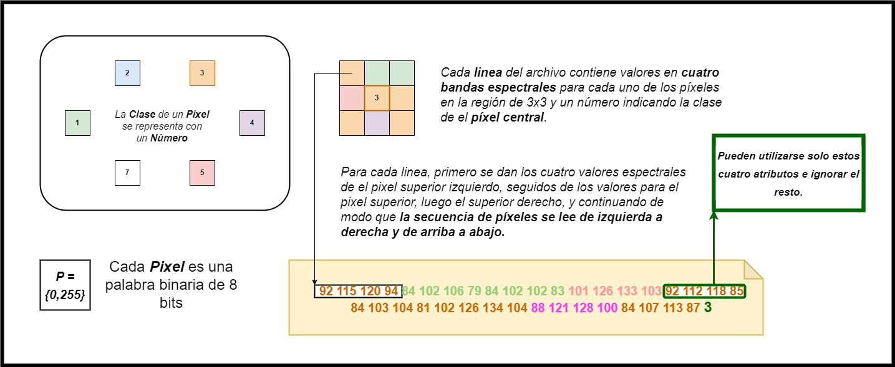

```{r setup, include=FALSE}
knitr::opts_chunk$set(echo = TRUE)
library(dplyr)
library(rpart)
library(rpart.plot)
library(glm2)
library(GGally)
library(gridExtra)
library(randomForest)
library(class)
library(viridis)
library(ggplot2)
library(ggcorrplot)
library(glue)
library(rmarkdown)
library(boot)
library(caret)
library(kableExtra)
library(pROC)
library(tree)
library(jtools)
library(scatterPlotMatrix)
suppressMessages(library(tidyverse))

utils.DataFrame.print <- function (df,head){
knitr::kable(head(df,head), format = "html", table.attr = "style='width:50%;'") %>% 
  kableExtra::kable_styling() 
}

utils.color_theme <- function(){
  list(scale_fill_manual(values=c('white','antiquewhite4','gray40','gray20','sienna3','olivedrab')), 
theme(panel.background = element_rect(fill = "paleturquoise", color = "black"),panel.grid.major = element_line(color = "paleturquoise3"),panel.grid.minor = element_line(color = "paleturquoise3")))
}


conf_matrix <- function(df.true, df.pred, title = "", true.lab ="Valor Verdadero", pred.lab ="Predicción",
                        high.col = 'green', low.col = 'white') {
  #convert input vector to factors, and ensure they have the same levels
  df.true <- as.factor(df.true)
  df.pred <- factor(df.pred, levels = levels(df.true))
  
  #generate confusion matrix, and confusion matrix as a pecentage of each true class (to be used for color) 
  df.cm <- table(True = df.true, Pred = df.pred)
  df.cm.col <- df.cm / rowSums(df.cm)
  
  #convert confusion matrices to tables, and binding them together
  df.table <- reshape2::melt(df.cm)
  df.table.col <- reshape2::melt(df.cm.col)
  df.table <- left_join(df.table, df.table.col, by =c("True", "Pred"))
  
  #calculate accuracy and class accuracy
  acc.vector <- c(diag(df.cm)) / c(rowSums(df.cm))
  class.acc <- data.frame(Pred = "Prec. Clase", True = names(acc.vector), value = acc.vector)
  acc <- sum(diag(df.cm)) / sum(df.cm)
  
  #plot
  ggplot() +
    geom_tile(aes(x=Pred, y=True, fill=value.y),
              data=df.table, size=0.2, color=grey(0.5)) +
    geom_tile(aes(x=Pred, y=True),
              data=df.table[df.table$True==df.table$Pred, ], size=1, color="black", fill = 'transparent') +
    scale_x_discrete(position = "top",  limits = c(levels(df.table$Pred), "Prec. Clase")) +
    scale_y_discrete(limits = rev(unique(levels(df.table$Pred)))) +
    labs(x=pred.lab, y=true.lab, fill=NULL,
         title= paste0(title, "\nPrecisión ", round(100*acc, 1), "%")) +
    geom_text(aes(x=Pred, y=True, label=value.x),
              data=df.table, size=4, colour="black") +
    geom_text(data = class.acc, aes(Pred, True, label = paste0(round(100*value), "%"))) +
    scale_fill_gradient(low=low.col, high=high.col, labels = scales::percent,
                        limits = c(0,1), breaks = c(0,0.5,1)) +
    guides(size="none") +
    theme_bw() +
    theme(panel.border = element_blank(), legend.position = "bottom",
          axis.text = element_text(color='black'), axis.ticks = element_blank(),
          panel.grid = element_blank(), axis.text.x.top = element_text(angle = 30, vjust = 0, hjust = 0)) +
    coord_fixed()

} 


utils.conf_matrix <- function(df.true, df.pred) {
class_names <- c("rojo", "algodón", "gris","gris húmedo", "vegetación", "gris muy húmedo")
class_values <- c(1,2,3,4,5,6)
class_map <- setNames(class_names, class_values)
df.true$C <- class_map[df.true$C]
num_to_str <- c("1" = "rojo", "2" = "algodón", "3" = "gris", "4" = "gris húmedo", "5" = "vegetación", "6" = "gris muy húmedo")
df.pred <- num_to_str[as.character(df.pred)]
return(conf_matrix(df.true$C,df.pred))
}

```

## **<font color=darkblue> Enunciado </font>**

En el archivo ***sat.txt*** se tienen datos de valores de espectros de pixels en una imagen de satélite utilizados para la ***predicción de la clase de suelo***. Realice un análisis de los datos utilizando diferentes métodos y compárelos mediante Validación Cruzada. Luego aplíquelos a la muestra de test ***sat.tst*** y analice los resultados obtenidos.

## **<font color=darkblue> Descripción de los Datos</font>**

<br>

- #### **Propósito**

La base de datos contiene los valores multi-espectrales de píxeles en regiones de 3x3 en una imágen satelital, y la clasificación asociada con el píxel central de cada región. El objetivo es predecir esta clasificación dados los valores multi-espectrales. 

- #### **Detalle**

Esta base de datos se generó a partir del ***escáner multi-espectral LANDSAT***. Un marco de imágenes Landsat MSS consta de ***cuatro imágenes*** digitales de la misma escena en ***diferentes bandas espectrales***. Dos de estos están en la región visible (correspondiente aproximadamente a las regiones verdes y rojas del espectro visible) y dos están en el infrarrojo. Cada ***píxel*** es una palabra binaria de 8 bits, con ***0*** correspondiente al negro y ***255*** a blanco. La resolución espacial de un píxel es de unos 80 m x 80m. Cada imagen contiene 2340 x 3380 de tales píxeles. 

La base de datos es una subárea (pequeña) de una escena, que consta de 82 x 100 píxeles. ***Cada línea de datos corresponde a una región de píxeles cuadrados 3x3*** completamente contenida dentro de la subárea 82x100. Cada línea contiene los valores de píxeles en las cuatro bandas espectrales (convertidas en ASCII) de cada uno de los 9 píxeles en la región 3x3 y un número que indica la etiqueta de clasificación del píxel central.

La ***clase*** de cada píxel se codifica como un número, siendo estos:

- ***1:*** suelo rojo
- ***2:*** cultivo de algodón
- ***3:*** suelo gris
- ***4:*** suelo gris húmdeo
- ***5:*** suelo con rastrojo de vegetación 
- ***6:*** mezcla de suelos
- ***7:*** suelo gris muy húmedo  

   -   **<font color='red'>N.B</font>**:
No hay ejemplos con la clase 6 en este conjunto de datos (fueron removidos debido a dudas respecto a la validez de esta clase). Los datos se dan en orden aleatorio y se han eliminado ciertas líneas de datos para que no pueda reconstruir la imagen original a partir de este conjunto de datos.

En cada línea de datos, ***los cuatro valores espectrales para el píxel superior izquierdo se dan primero***, seguidos por los cuatro valores espectrales para el píxel medio superior y luego los del píxel superior derecho, y así sucesivamente de modo que ***los píxeles se leen en secuencia de izquierda a derecha y de arriba a abajo***. Por lo tanto, los cuatro valores espectrales para los píxeles centrales están dados por los atributos 17,18,19 y 20. ***Si lo desea, puede usar solo estos cuatro atributos***, ignorando los demás.

- ***DATOS TOTALES*** &rarr; set de entrenamiento: 4435 set de prueba: 2000
- ***CANTIDAD DE ATRIBUTOS*** &rarr; 36 (4 bandas espectrales x 9 píxeles en una región)
- ***ATRIBUTOS*** &rarr; numéricos en el rango {0,255}
- ***CLASES*** &rarr; 6 en total: {1,2,3,4,5,7}


## **<font color=darkblue> Resolución </font>**

### **<font color=darkblue> Obtención del Set de Datos </font>**

Dado que el enunciado menciona que pueden utilizarse solo los datos espectrales
correspondientes al píxel central, buscamos extraerlos, junto con su clasificación,
a una sola dataframe.





```{r}
file_trn = "SAT_trn.txt"
data_trn <- read.table(file_trn, sep = "", header=F)
sat_trn_df <- data_trn      %>% 
  select(17:20,37)  %>% 
  rename(B1=V17,
         B2=V18,
         B3=V19,
         B4=V20,
         C=V37)
file_tst = "SAT_tst.txt"
data_tst <- read.table(file_tst, sep = "", header=F)
sat_tst_df <- data_tst      %>% 
  select(17:20,37)  %>% 
  rename(B1=V17,
         B2=V18,
         B3=V19,
         B4=V20,
         C=V37)
```

```{r}
sat_trn_df$C[sat_trn_df$C == 7] <- 6
sat_tst_df$C[sat_tst_df$C == 7] <- 6
sat_trn_df_numeric <- data.frame(sat_trn_df)
sat_tst_df_numeric <- data.frame(sat_tst_df)
class_names <- c("rojo", "algodón", "gris","gris húmedo", "vegetación", "gris muy húmedo")
class_values <- c(1,2,3,4,5,6)
class_map <- setNames(class_names, class_values)
sat_trn_df$C <- class_map[sat_trn_df$C]
sat_tst_df$C <- class_map[sat_tst_df$C]
```


## **<font color=darkblue> Visualización de los Datos</font>**

#### Contenido del Set de Datos

```{r,echo=FALSE,warning=FALSE,message=FALSE}
utils.DataFrame.print(sat_trn_df,10)
```

Podemos comprobar que tenemos valores acotados entre 0 y 255 para cuatro bandas espectrales y una categoría de suelo asignada en cada fila. Los contenidos pueden visualizarse mejor utilizando un gráfico de coordenadas paralelas.

```{r,echo=FALSE,warning=FALSE,message=FALSE,fig.align='center'}
gpc_trn <- ggparcoord(sat_trn_df, columns = 1:4, groupColumn = "C", scale='globalminmax',title="Datos de Entrenamiento") + 
scale_colour_manual(values=c('white','antiquewhite4','gray40','gray20','sienna3','olivedrab')) + 
utils.color_theme()
gpc_tst <- ggparcoord(sat_tst_df, columns = 1:4, groupColumn = "C",scale='globalminmax',title="Datos de Prueba") +  scale_colour_manual(values=c('white','antiquewhite4','gray40','gray20','sienna3','olivedrab')) +
utils.color_theme()
grid.arrange(gpc_trn, gpc_tst, nrow = 2)
```

Donde cada linea representa una observación para las 4 bandas. La normalización de los valores no es necesaria ya que $B_1:B_4$ estan en la misma escala. Podemos ver que la distribución de suelo en los datos de entrenamiento y prueba es practicamente la misma.

```{r,echo=FALSE,warning=FALSE,message=FALSE,fig.align='center'}
ggpairs(sat_trn_df, aes(color = C)) + scale_fill_manual(values=c('white','antiquewhite4','gray40','gray20','sienna3','olivedrab')) + scale_colour_manual(values=c('white','antiquewhite4','gray40','gray20','sienna3','olivedrab')) + 
utils.color_theme()
```

```{r,echo=FALSE,warning=FALSE,message=FALSE,fig.align='center'}
dns_B1 <- ggplot(sat_trn_df, aes(x = B1, fill = C)) +
  geom_density(alpha = 1) +
  facet_grid(C ~ .) +  
  guides(fill = FALSE) + utils.color_theme()
dns_B2 <- ggplot(sat_trn_df, aes(x = B2, fill = C)) +
  geom_density(alpha = 1) +
  facet_grid(C ~ .) +  
  guides(fill = FALSE) + utils.color_theme()
dns_B3 <- ggplot(sat_trn_df, aes(x = B3, fill = C)) +
  geom_density(alpha = 1) +
  facet_grid(C ~ .) +
  guides(fill = FALSE) + utils.color_theme()
dns_B4 <- ggplot(sat_trn_df, aes(x = B4, fill = C)) +
  geom_density(alpha = 1) +
  facet_grid(C ~ .) +
  guides(fill = FALSE) + utils.color_theme()
grid.arrange(dns_B1,dns_B2,dns_B3,dns_B4, ncol = 4)

```

```{r,echo=FALSE,warning=FALSE,message=FALSE,fig.align='center'}
vio_B1 <- ggplot(sat_trn_df, aes(x = C, y = B1, fill = C)) +
  geom_violin() +
  guides(fill = FALSE) +
  utils.color_theme()
vio_B2 <- ggplot(sat_trn_df, aes(x = C, y = B2, fill = C)) +
  geom_violin() +
  guides(fill = FALSE) +
  utils.color_theme()
vio_B3 <- ggplot(sat_trn_df, aes(x = C, y = B3, fill = C)) +
  geom_violin() +
  guides(fill = FALSE) + 
  utils.color_theme()
vio_B4 <- ggplot(sat_trn_df, aes(x = C, y = B4, fill = C)) +
  geom_violin() +
  guides(fill = FALSE) + 
  utils.color_theme()
grid.arrange(vio_B1,vio_B2,vio_B3,vio_B4, nrow =2, ncol = 2)
```

```{r,echo=FALSE,warning=FALSE,message=FALSE,fig.align='center'}
library(ggplot2)

ggplot(sat_trn_df, aes(x = B1, fill = C)) + 
  geom_bar(position = "stack") +
  labs(x = "B1", y = "Count", fill = "Category") + 
  utils.color_theme()
```

## **<font color=darkblue>Construcción de Modelos</font>**

```{r}
sat_trn_df <- data.frame(sat_trn_df_numeric)
sat_tst_df <- data.frame(sat_tst_df_numeric)
sat_trn_df$C <- as.factor(sat_trn_df$C)
sat_tst_df$C <- as.factor(sat_tst_df$C)
set.seed(20)
```

### **<font color=darkblue> Árbol de Decisión </font>**

### Librería Tree


```{r}
# Entrenamiento del Modelo
n <- nrow(sat_trn_df)
sat_tree <- tree(C ~ B1 + B2 + B3 + B4, 
                 data= sat_trn_df, 
                 control=tree.control(
                   nobs= nrow(sat_trn_df), 
                   mincut = 1, 
                   minsize = 2, 
                   mindev = 0)
                 )
# Resultados
sat_tree_summary <- summary(sat_tree)
EEnt <- sat_tree_summary$misclass[1] / n
sat_tree_summary
```

```{r}
sat_tree_CV = cv.tree(sat_tree, FUN = prune.misclass)
size <- sat_tree_CV$size
dev <- sat_tree_CV$dev
sp <-ggplot(data=data.frame(size,dev), aes(x=size, y=dev)) +
  geom_line(linetype="solid", color="blue", size=1.2)+
  geom_point(color="red", size=3)+
  labs(x= "Tamaño del Árbol", y = "Error de CV",title="Poda de Complejidad de Costos")
sp + scale_x_continuous(trans='log10')
# Agrego código para obtener con R el mejor Tamaño
best_size <- which.min(sat_tree_CV$dev) 
best_size
```

```{r}
# PQ Harcodea el 13?
sat_tree_prune = prune.misclass(sat_tree, best = 13)
plot(sat_tree_prune)
text(sat_tree_prune, pretty = 0)
CVErr_tree <- sat_tree_CV$dev[39] / n
CVErr_tree
```

### Librería RPart

```{r}
set.seed(20)
# Entrenamiento del Modelo con 10-fold CV  
sat_rpart <-  rpart(C ~ B1 + B2 + B3 + B4, data= sat_trn_df, method = "class", cp=-1,xval=10)
sat_rpart_summary <- printcp(sat_rpart)
```

```{r}
plotcp(sat_rpart) 
which.min(sat_rpart$cptable[,4])
cp<-sat_rpart$cptable[which.min(sat_rpart$cptable[,"xerror"]),"CP"]
cp
CVErr_rpart = sat_rpart$frame[1,'dev'] / n * sat_rpart$cptable[which.min(sat_rpart$cptable[,"xerror"]),"xerror"]
CVErr_rpart
poda_rpart<-prune(sat_rpart,cp=cp)
rpart.plot(poda_rpart, cex = 0.5, extra = 0)
```


### **<font color=darkblue> Random Forest </font>**

```{r}
set.seed(20)
sat_rf<- randomForest(C~., data= sat_trn_df, 
                     mtry=sqrt(ncol(sat_trn_df)-1), importance=TRUE)

importance(sat_rf)
varImpPlot(sat_rf)
CVErr_rf <- unname(sat_rf$err.rate[nrow(sat_rf$err.rate),1])
CVErr_rf
```

- ***Obs:***
Del análisis previo concluimos que el valor del pixel central en la primera banda es el principal predictor de la clase.

### **<font color=darkblue> Vecinos Más Cercanos </font>**


```{r}
set.seed(20)
sat_knn <- train(C ~ ., data = sat_trn_df, 
                   method = "knn",
                   preProcess = c("center","scale"),
                   trControl =  trainControl(method = "cv", number = 10),
                   tuneGrid = expand.grid(k = 1:100),
                   metric = "Accuracy")
results <- sat_knn$results
ggplot(results, aes(x = k, y = Accuracy)) + 
  geom_line(color = "steelblue", size = 1.2) + 
  xlab("Valor de K") + 
  ylab("Exactitud") + 
  ggtitle("Rendimiento para diferentes valores de K") +
  theme_bw() + 
  theme(plot.title = element_text(face = "bold", size = 14, hjust = 0.5),
        axis.title.x = element_text(face = "bold", size = 12),
        axis.title.y = element_text(face = "bold", size = 12),
        axis.text = element_text(size = 10),
        panel.grid.major = element_blank(),
        panel.grid.minor = element_blank(),
        panel.border = element_blank(),
        panel.background = element_blank())
best_k <- results$k[which.max(results$Accuracy)]
best_k
CVErr_KNN <- 1-unname(sat_knn$results[best_k,"Accuracy"])
CVErr_KNN
```


### **<font color=darkblue> Regresión Logística Multinomial </font>**

```{r,results = FALSE,echo=FALSE,warning=FALSE,message=FALSE,fig.align='center'}
sat_trn_df$C <- factor(sat_trn_df$C)
#sat_tst_df$C <- factor(sat_tst_df$C)

sat_mlr <- train(C ~ ., 
               data = sat_trn_df, 
               method = "multinom", 
               trControl = trainControl(method = "cv", number = 10))
```


```{r}
summary(sat_mlr)
#sat_mlr <- nnet::multinom(C ~ ., data = sat_trn_df)
#summary(sat_rl)
# Predict the class labels for the training data
confusion_matrix <- confusionMatrix(predict(sat_mlr, newdata = sat_trn_df), sat_trn_df$C)
confusion_matrix$overall['Accuracy']

predicted_mlr <- predict(sat_mlr, newdata = sat_trn_df)

CVErr_mlr <- mean(predicted_mlr != sat_trn_df$C)
CVErr_mlr
#pred_nnet <- predict(model_nnet, newdata = sat_tst_df, type = "class")
#accuracy_nnet <- mean(pred_nnet == sat_tst_df$C)
#cat("Accuracy score for nnet:", round(accuracy_nnet, 3), "\n")
```

### **<font color=darkblue> Comparación del Error de 10-fold CV</font>**


```{r}
models <- c("tree", "rpart", "RF", "KNN", "RLM")
CVErrs <- c(CVErr_tree,CVErr_rpart,CVErr_rf,CVErr_KNN,CVErr_mlr)

# Combine the arrays into a data frame
CVErr_df <- data.frame(Label = models, Value = CVErrs)

# Plot a bar chart using ggplot2
ggplot(CVErr_df, aes(x = Label, y = Value)) + 
  geom_bar(stat = "identity", color = "black", fill = "red") + labs(x = "Modelos", y = "Error de Validación Cruzada K=10", title = "Comparación de Precisión de Modelos") +
  theme(plot.title = element_text(hjust = 0.5))
```

```{r}
#conf_mat <- caret::confusionMatrix(pred_nnet, sat_tst_df$C)
#conf_mat
```

```{r}
#conf_matrix(sat_tst_df$C,pred_nnet)
```

```{r}
#probs <- predict(model_nnet, newdata = sat_tst_df, type = "probs")
#ROC <- multiclass.roc(response = sat_tst_df$C, predictor = probs)
```

```{r}
#auc(ROC)
```

```{r}

```


## **<font color=darkblue>Evaluación de los Modelos contra el Set de Entrenamiento</font>**

### **<font color=darkblue>Árbol de Clasificación</font>**

### Librería Tree

```{r,echo=FALSE,warning=FALSE,message=FALSE}
sat_tree_pred <- predict(sat_tree, sat_tst_df, type = "class")
#conf_table <- table(sat_tst_df$C,sat_tree_pred)
#conf_table
utils.conf_matrix(sat_tst_df,sat_tree_pred)
```


### Librería Rpart

```{r,echo=FALSE,warning=FALSE,message=FALSE}
sat_rpart_pred <- predict(sat_rpart,sat_tst_df,type="class")
utils.conf_matrix(sat_tst_df,sat_rpart_pred)
```

### **<font color=darkblue>Random Forest</font>**

```{r,echo=FALSE,warning=FALSE,message=FALSE}
sat_rf_pred <- predict(sat_rf,sat_tst_df,type="class")
utils.conf_matrix(sat_tst_df,sat_rf_pred)
```

### **<font color=darkblue>Regresión Logística Multinomial</font>**

```{r,echo=FALSE,warning=FALSE,message=FALSE}
sat_mlr_pred <- predict(sat_mlr,sat_tst_df)
utils.conf_matrix(sat_tst_df,sat_mlr_pred)
```

### **<font color=darkblue>Vecinos Más Cercanos</font>**

```{r,echo=FALSE,warning=FALSE,message=FALSE}
sat_knn_pred <- predict(sat_knn,sat_tst_df)
utils.conf_matrix(sat_tst_df,sat_knn_pred)
```

### **<font color=darkblue> ANEXO: Análisis Para el Set de Datos Completo </font>**

Queremos comprobar:

- Que el píxel central es en efecto el principal predictor de la clase de la celda
- Que  despreciar los píxeles adyacentes al píxel central no produce una reducción significativa en el error de clasificación.

```{r}

sat_trn_df_full <- data_trn
sat_trn_df_full$V37 <- as.factor(sat_trn_df_full$V37)

n <- nrow(sat_trn_df_full)
full_tree <- tree(V37 ~., data= sat_trn_df_full, control=tree.control(nobs= nrow(sat_trn_df_full), mincut = 1, minsize = 2))
full_tree_summary <- summary(full_tree)
EEnt <- full_tree_summary$misclass[1] / n
#full_tree_summary

set.seed(20)
full_tree_CV = cv.tree(full_tree, FUN = prune.misclass)
full_size <- full_tree_CV$size
full_dev <- full_tree_CV$dev
#ggplot(data=data.frame(full_size,full_dev), aes(x=full_size, y=full_dev)) +
#  geom_line(linetype="solid", color="blue", size=1.2)+
#  geom_point(color="red", size=3)+
#  labs(x= "Tamaño del Árbol", y = "Error de CV",title="Poda de Complejidad de Costos")

prune_full = prune.misclass(full_tree, best = 10)
plot(prune_full)
text(prune_full, pretty = 0)
```


```{r}
set.seed(20)
full_tree_2 <-  rpart(V37 ~., data= sat_trn_df_full, method = "class", cp=-1,xval=10)
full_tree_2_summary <- printcp(full_tree_2)
full_tree_2_NP_pred <- predict(full_tree_2, sat_trn_df_full, type = "class")
# Poda
#full_tree_2$cptable 
#plotcp(full_tree_2) #grafico
#which.min(full_tree_2$cptable[,4])
cp<-full_tree_2$cptable[which.min(full_tree_2$cptable[,"xerror"]),"CP"]
poda<-prune(full_tree_2,cp=cp)
rpart.plot(poda, cex = 0.5, extra = 0)
```

```{r}
set.seed(20)
rf_full<- randomForest(V37~., data= sat_trn_df_full, 
                     mtry=sqrt(ncol(sat_trn_df_full)-1), importance=TRUE)

#importance(rf_full)
varImpPlot(rf_full)
unname(rf_full$err.rate[nrow(rf_full$err.rate),1])
```